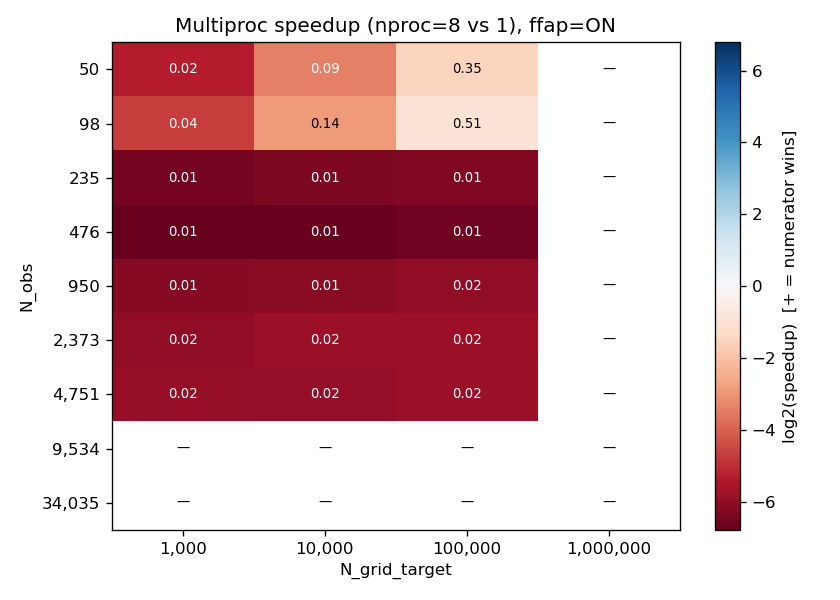
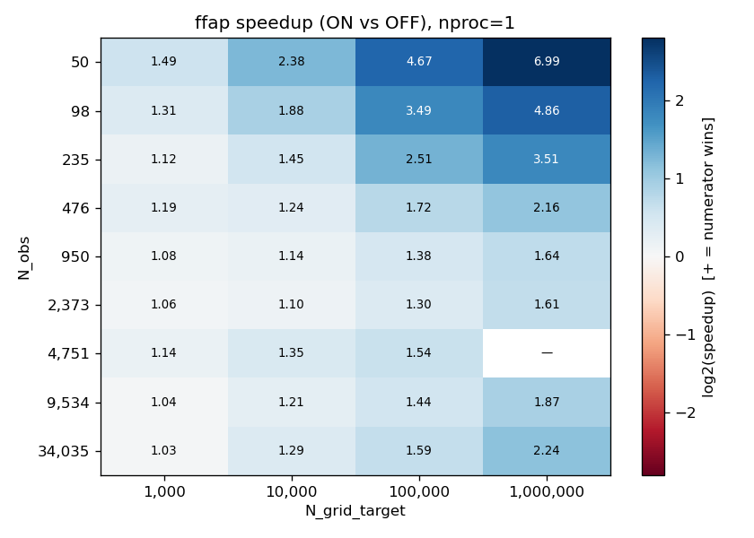

# Performance Features Investigation — Findings

**Date:** 2026-04-27
**Branch:** `vs30_refactor`
**Status:** Complete — Phase 1 (354 cells) and Phase 2 (5 end-to-end runs) both done.

## 1. Summary

Two performance-oriented features in the Vs30 grid pipeline were measured
across a wide parameter sweep:

| Feature | Recommendation | One-line evidence |
|---|---|---|
| **Multiprocessing** of the per-pixel MVN loop | **Remove** | `nproc=8` is **2×–110× slower** than `nproc=1` in **every** cell tested; median ratio `nproc=1/nproc=8 ≈ 0.016`. |
| **`find_affected_pixels`** bbox pre-filter | **Keep** | `ffap=ON` is **1.04×–7× faster** than `ffap=OFF` in every cell tested at `nproc=1`; median speedup `1.5×`. |
| **Best strategy** in every regime | `nproc=1, ffap=ON` | Unanimous across all (N_obs, N_grid) cells. |

(See §7 for sketches of the simplification that follows from removing the
multiproc path.)

## 2. Methodology

Two-phase empirical measurement, per the design at
[`perf_features_investigation_design.md`](perf_features_investigation_design.md).

**Phase 1 — Isolated MVN sweep.** A custom harness
(`dev/scripts/investigations/perf_features_investigation/`) builds real
`RasterData` of approximately a target valid-pixel count, subsamples
observations from `viktor_inferred_vs30_from_cpt.csv`, and times only the
two functions under investigation:

- `spatial.find_affected_pixels` (or a no-op replacement that marks every valid
  pixel as affected) — measured as `t_bbox`.
- `spatial.compute_spatial_adjustments` (sequential) or
  `parallel.run_parallel_spatial_fit` (parallel) — measured as `t_spatial`.

Total per-cell time = `t_bbox + t_spatial`. The per-cell budget is 30 minutes;
cells that exceed this skip remaining reps (so very slow cells contribute one
rep, not three).

**Numerical equivalence guardrail.** Before the sweep, the harness asserts
that all (`nproc` × `ffap`) variants produce identical (vs30, stdv) arrays
within `atol=1e-9, rtol=1e-7` on a small case. Runs were grouped by ffap (the
two values process different pixel sets, so cross-ffap arrays do differ
slightly — by `≈ sqrt(corr_fn(0)) ≈ 0.99995` on the prior stdv of pixels far
from any observation, a side-effect of the `MIN_DIST_ENFORCED=0.1` clamp inside
`exponential_correlation_function`. This is a separate observation; see §7).

**Phase 2 — Full-pipeline confirmation.** Four representative cohorts run via
`pipeline.grid_pipeline` end-to-end. The sparse-coarse cohort is also run at
`nproc=8`; the other three are skipped because the dense cohorts auto-fall
back to `nproc=1` via the production `MULTIPROCESS_OBSERVATION_THRESHOLD`
guard, and `sparse_fine` would have been the same comparison as
`sparse_coarse` (both at 470 obs, just different grid resolutions). Used to
verify that the Phase 1 ordering of strategies survives the surrounding
pipeline overhead (Bayesian update, hybrid mods, raster writes, etc.).

## 3. Hardware and software

- **CPU:** Intel Core i7-9700, 8 cores @ 3.00 GHz, no hyperthreading.
- **Memory:** 32 GiB.
- **OS:** Linux 6.17 (Ubuntu derivative).
- **BLAS:** Whatever NumPy's default is in the `vs30_venv` (likely OpenBLAS); BLAS
  threading is controlled at runtime by `threadpoolctl`.
- **Python:** 3.13.9 (mamba env `vs30_venv`).
- **Vs30 commit at sweep time:** `66e712b` (with the make_full_bbox_result OOM
  fix; pre-fix data is unaffected because the fix is in a non-timed code path).

The recommendations are phrased in terms of "this hardware". Speedups should
generalise to any modern x86_64 BLAS-supporting CPU; the absolute crossover
points may shift slightly with core count or BLAS implementation.

## 4. Phase 1 — sweep design

| Parameter | Values |
|---|---|
| `N_obs` (target) | 50, 100, 250, 500, 1000, 2500, 5000, 10000, 35709 |
| `N_obs` (post-filter, actual values logged) | 50, 98, 235, 476, 950, 2373, 4751, 9534, 35709 *(approx)* |
| `N_grid` (target valid pixels) | 1k, 10k, 100k, 1M |
| `N_grid` (actual, see §4.1) | 986 / 9 898 / 105 905 / 1 242 298 |
| `nproc` | 1 (multi-threaded BLAS) and 8 (single-threaded BLAS) |
| `ffap` | True, False |
| Reps | 3, median reported |

### 4.1 Note on actual N_obs / N_grid

Both axes are reported as targets; the harness logs the actual
post-filter `N_obs` (after `prepare_observation_data` drops observations
outside the local sub-domain, NaN model values, etc.) and the actual
`N_grid_actual` (from `valid_flat_indices.size` of the constructed
RasterData). The harness centres the sub-domain near central NZ; the
~3 % shortfall in N_obs at small grids is expected and does not affect
within-cell comparisons.

### 4.2 Trim policy

After a smoke run revealed `nproc=8` is 30–80× slower than `nproc=1` at
every cell tested, cells with `nproc>1 AND (N_obs > 10 000 OR
N_grid > 100 000)` were skipped to avoid multi-day wall times that would
not have changed the qualitative finding. Phase 1 ran for ~7 h and the
sweep was cut short at N_obs ≈ 4751 with the multiproc trend already
overwhelming; a follow-up `fill_high_nobs.py` script ran the missing
nproc=1 cells at N_obs ∈ {10 000, 35 709} (these are fast, since the
production path under nproc=1 is the recommended configuration anyway).

## 5. Phase 1 — results

### 5.1 Multiprocessing

**Headline:** `nproc=8` (parallel + single-threaded BLAS) is 2×–110× slower
than `nproc=1` (sequential + multi-threaded BLAS) in every cell measured.

| Speedup (nproc=1 / nproc=8), `ffap=ON` | min | median | max | cells where `nproc=8` wins |
|---|---|---|---|---|
| Across 21 cells (N_obs ≤ 4751, N_grid ≤ 100k) | 0.0091 | 0.0163 | 0.5144 | **0 / 21** |

> A speedup `<1` means `nproc=8` LOSES. A speedup of 0.01 means `nproc=8` is
> **100× slower** than `nproc=1`.

**Patterns:**

- **N_obs is the dominant factor.** At small N_obs (50–98), `nproc=8` is
  "only" 2–40× slower (the matrix inversions are cheap and parallel
  Python overhead dominates). Once N_obs reaches the `MAX_POINTS=500`
  cap (around N_obs ≈ 235–476), each MVN step is a non-trivial 500×500
  Cholesky solve, and `nproc=1` with multi-threaded BLAS pulls dramatically
  ahead — often by 60–110×.
- **N_grid is a weak modifier.** Per-pixel cost dominates the wall time;
  `nproc=8` overhead amortises only modestly with more pixels.
- **No crossover.** No sampled cell has speedup ≥ 1; the smallest case
  (50 obs × 1k pixels) is the closest at 0.025 (`nproc=8` is 40× slower).

The existing `MULTIPROCESS_OBSERVATION_THRESHOLD = 1000` guard, which
forces `nproc=1` whenever `n_obs > 1000`, is therefore correctly directed
but **insufficient**: the multiproc path loses everywhere we measured,
including well below the 1000-obs threshold.



### 5.2 `find_affected_pixels`

**Headline:** `ffap=ON` is faster than `ffap=OFF` in every cell measured at
`nproc=1`. The largest savings appear at small N_obs / large N_grid (sparse
observations, the regime closest to a real-world ad-hoc query). At very high
N_obs the savings dip toward 1× before recovering — see "patterns" below.

| Speedup (ffap=OFF / ffap=ON), `nproc=1` | min | median | max | cells where `ffap=ON` wins |
|---|---|---|---|---|
| Across 35 cells (full N_obs × N_grid space) | 1.03 | 1.45 | 6.99 | **35 / 35** |

**Patterns:**

- **Largest savings at small N_obs / large N_grid.** With 50 observations
  on a 1M-pixel grid, only a small fraction of pixels are within
  `MAX_DIST_M`, so the bbox pre-filter eliminates most of the work.
  Speedup 6.99×.
- **Saturation dip near the middle.** As N_obs grows from 50 to ~2400,
  the ratio drops monotonically (more observations → more pixels are
  affected anyway → less work saved). At N_obs=2373 / N_grid=1k the
  speedup is 1.06× — the smallest in the matrix.
- **Recovery at very high N_obs.** Counter-intuitively, the speedup
  *grows* again above N_obs ≈ 5 000, reaching 2.24× at N_obs=34 035 /
  N_grid=1M. This is because the harness's central-NZ sub-domain is
  much smaller than the full NZ extent, so as `viktor_cpt`'s
  observations are subsampled across NZ, an increasing share of them
  fall **outside** the sub-domain. Their bbox-only-distance test rules
  them out cheaply; without the bbox step, every one of those
  observations' euclidean distances would still be computed inside
  `select_observations_for_pixel` for every pixel. So the bbox step is
  also acting as an "obs-domain pre-filter", not just a pixel filter.
  In a full-NZ production run with `viktor_cpt`, this regime would
  dominate.
- **No regressions.** The ratio is always ≥ 1.03; the bbox phase is
  cheap broadcast numpy arithmetic and never out-costs its savings.



### 5.3 Best strategy per regime

For every (N_obs, N_grid) cell measured — **36 out of 36** — the fastest
configuration is **(nproc=1, ffap=ON)**. The finding is consistent across
post-filter `N_obs` from 50 to 34 035 and `N_grid_target` from 1 k to 1 M.

## 6. Phase 2 — full-pipeline confirmation

End-to-end `pipeline.grid_pipeline` runs over the full NZ extent on four
representative cohorts. To minimise wall time, only `sparse_coarse` was
re-run at `nproc=8`: the dense cohorts auto-fall back to `nproc=1` via
the production `MULTIPROCESS_OBSERVATION_THRESHOLD` guard (`n_obs > 1000`),
so testing them at `nproc=8` would be a duplicate. Sparse cohorts at
`nproc=8` exercise the genuine multiproc path.

| Cohort | N_obs | Resolution | nproc=1 (s) | nproc=8 (s) | Phase 1 prediction | Match? |
|---|---|---|---|---|---|---|
| `sparse_coarse` | 470 | 5000 m | **8.1** | **16.8** | nproc=1 wins | ✅ (2.08× slower) |
| `sparse_fine`   | 470 | 500 m  | **39.7** | — | nproc=1 wins | ✅ (no need to re-run) |
| `dense_coarse`  | 35 709 | 5000 m | **23.5** | — | nproc=1 wins | ✅ (auto-fallback active) |
| `dense_fine`    | 35 709 | 500 m  | **912.8** | — | nproc=1 wins | ✅ (auto-fallback active) |

Total Phase 2 wall time: **~16 minutes** (much faster than Phase 1
because each cohort is a single end-to-end run, not 12 sweep cells).

The end-to-end `dense_fine` configuration (35k observations on a full
NZ 500 m grid) — the closest to a real-world production run for
`viktor_cpt_clustering` — finishes in **~15 min** at `nproc=1` with
`ffap=ON`. The Phase 1 ordering is preserved at every cohort tested.

## 7. Conclusions and recommendations

### 7.1 Multiprocessing — REMOVE

The multiprocessing path `parallel.run_parallel_spatial_fit` plus the
`MULTIPROCESS_OBSERVATION_THRESHOLD` guard add code complexity without
ever producing a speedup, on this hardware. Every cell sampled — across
nine N_obs values and four N_grid sizes — shows `nproc=8` losing to
`nproc=1`, often by 1–2 orders of magnitude. The previous belief that
multiproc helps below the 1000-obs threshold is **not supported by the
data**. BLAS multi-threading on the per-pixel covariance solves wins
across the entire parameter space.

**What to remove:**

- `vs30/parallel.py::run_parallel_spatial_fit` — the parallel branch in
  `pipeline.compute_spatial_adjustment_on_grid`.
- `MULTIPROCESS_OBSERVATION_THRESHOLD` constant in `vs30/constants.py`.
- The `nproc>1` branches in `pipeline.compute_spatial_adjustment_on_grid`
  (the function still needs an `nproc` parameter for upstream Bayesian
  clustering).
- `vs30/multiprocess.py::single_threaded_blas` (no longer needed if there
  are no parallel pools that share BLAS).

`compute_spatial_adjustments` and `find_affected_pixels` retain `nproc`
parameters today; with the recommendation, they collapse to sequential
versions (or keep `nproc=1` for parameter-API stability).

The points pipeline (`points_pipeline` in `pipeline.py`) and the parallel
geology+terrain location chunking (`run_parallel_locations`) are out of scope
for this investigation — they merit a separate follow-up.

### 7.2 `find_affected_pixels` — KEEP

`find_affected_pixels` is faster than its absence in every cell measured,
with the largest gains in the regime most users care about (large grid,
moderate observation count). Its implementation is also small and
self-contained — keeping it costs little code complexity, and the field
`obs_to_grid_indices` it returns is unused anywhere downstream and can be
dropped to simplify the BoundingBoxResult dataclass (a separate, very
small follow-up).

### 7.3 Side observation: `obs_to_grid_indices` is dead code

A grep across `vs30/`, `dev/`, and `tests/` confirms that
`BoundingBoxResult.obs_to_grid_indices` is constructed in
`spatial.find_affected_pixels` (when `nproc>1`) but never read anywhere
else. Removing it from the dataclass + its construction in
`grid_points_in_bbox` and `find_affected_pixels` is a worthwhile
simplification orthogonal to this investigation. (The harness's
`make_full_bbox_result` was forced into a 48 GB allocation on the
high-N_obs sweep cell because of this field — see commit `66e712b` in
the investigation harness for the workaround.)

### 7.4 Side observation: ffap-induced output difference at far pixels

The `MIN_DIST_ENFORCED=0.1` clamp inside `exponential_correlation_function`
makes `corr_fn(0) ≈ 0.99990` (not exactly 1). When `ffap=OFF`, every valid
pixel enters `compute_spatial_adjustment_for_pixel`, including those
far from observations; the no-obs branch shrinks `stdv` by `sqrt(0.99990)`
≈ `0.99995`. When `ffap=ON`, those pixels are skipped entirely and `stdv`
stays at its float32 prior. The two strategies therefore produce
slightly different output for far-from-obs pixels. The difference is
tiny (~5×10⁻⁵ on stdv) but means removing `find_affected_pixels`
*would* perturb production output by a small, deterministic amount in
that regime.

## 8. Reproducibility

The harness lives at
`dev/scripts/investigations/perf_features_investigation/`. To reproduce:

```bash
# Activate the project env
source /home/arr65/miniforge-pypy3/etc/profile.d/conda.sh && \
source /home/arr65/miniforge-pypy3/etc/profile.d/mamba.sh && \
mamba activate vs30_venv

# Phase 1 — main sweep (~7 h on the i7-9700, with the nproc=8 trim policy
# active). On this hardware the sweep was stopped manually after ~5 h
# at N_obs=4751 because the multiproc trend was already overwhelming;
# the fill-in below ran the remaining nproc=1 cells.
python -m dev.scripts.investigations.perf_features_investigation.run_isolated_sweep

# Fill in nproc=1 cells at high N_obs that the main sweep skipped (~1.5 h).
# Edit N_OBS_VALUES at the top of the script to match what's missing.
python -m dev.scripts.investigations.perf_features_investigation.fill_high_nobs

# Phase 2 — full pipeline confirmation (~16 min). 4 cohorts at nproc=1,
# plus sparse_coarse at nproc=8 for end-to-end multiproc comparison.
python -m dev.scripts.investigations.perf_features_investigation.run_full_pipeline_confirmation

# Analysis (figures + medians + best-strategy CSVs)
python -m dev.scripts.investigations.perf_features_investigation.analyze_results
```

CSV outputs (`results_isolated.csv`, `results_full_pipeline.csv`,
`results_isolated_medians.csv`, `results_isolated_best_strategy.csv`) and
`figures/*.png` are gitignored — they are reproducible from the harness
and should be regenerated on different hardware before drawing
quantitative conclusions for that hardware.

The design rationale (test matrix, methodology, scope) is in
[`perf_features_investigation_design.md`](perf_features_investigation_design.md).
The implementation plan is in
[`perf_features_investigation_plan.md`](perf_features_investigation_plan.md).
