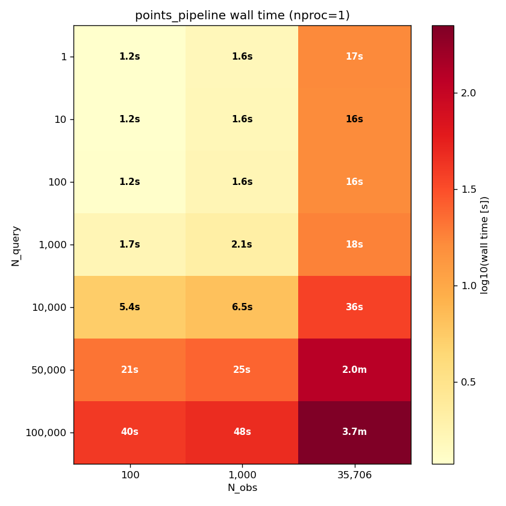
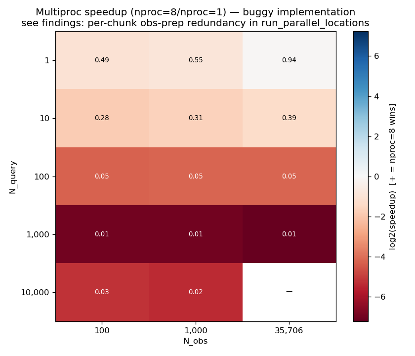

# Points-Mode Performance Investigation — Findings

**Date:** 2026-04-28
**Branch:** `vs30_refactor`
**Status:** Complete — sweep partially run, bug discovered mid-sweep, sweep retrimmed and completed for the ffap question. Fix is out of scope; see §6.
**Predecessors:**
- [Design](points_perf_investigation_design.md)
- [Grid investigation findings](perf_features_investigation_findings.md)

## 1. Summary

A per-chunk obs-prep redundancy bug in `vs30/parallel.py::run_parallel_locations` makes the `nproc=8` path up to 151× slower than `nproc=1` at large N_query, completely swamping the inherent multiproc/BLAS-MT tradeoff this investigation set out to measure. The `nproc=1` sequential path is unaffected and fast enough at all tested scales that no `find_affected_points` follow-up is warranted.

| Question | Answer | Evidence |
|---|---|---|
| Does multiproc ever win for `points_pipeline` in realistic regimes? | **No** — and the apparent margin gets dramatically worse with N_query, due to a per-chunk obs-prep redundancy bug in `vs30/parallel.py::run_parallel_locations` | Speedup pivot, §3 |
| Should `vs30 points --nproc` default change? | **Yes** — set the CLI default to `nproc=1` until the bug is fixed | §5.1 |
| Is a `find_affected_points` follow-up worth pursuing? | **No** — sequential is fast enough at the upper bound (100k × 35,706 = 3.7 min < §7's 5-min threshold) | Absolute-time table, §3 + §5.2 |

## 2. Methodology

The investigation followed the methodology in the [design doc](points_perf_investigation_design.md) — randomly sampled NZ-land query points, the `modified_foster_2019` model config, and end-to-end timing of `pipeline.points_pipeline` over the (N_query, N_obs, nproc) matrix. After a mid-sweep diagnosis (§4) the matrix was trimmed to `nproc=1` only and rerun cleanly; the buggy `nproc=8` partial data was preserved as evidence.

## 3. Results

### 3.1 nproc=1 absolute wall time

| N_query | N_obs=100 | N_obs=1,000 | N_obs=35,706 |
|---|---|---|---|
| 1 | 1.21 s | 1.58 s | 16.62 s |
| 10 | 1.19 s | 1.60 s | 16.41 s |
| 100 | 1.23 s | 1.65 s | 16.50 s |
| 1,000 | 1.67 s | 2.13 s | 18.35 s |
| 10,000 | 5.37 s | 6.49 s | 36.48 s |
| 50,000 | 20.90 s | 24.83 s | 118.98 s |
| 100,000 | 40.26 s | 47.76 s | **222.97 s** |

(Per-cell medians over 3 reps. Values from `results_points_medians.csv`.)



The cost is dominated by a one-time observation-prep step (~16 s for the full viktor_cpt with 35,706 rows). Per-query-point cost is approximately 2 ms at full N_obs.

### 3.2 Multiproc bug (partial data — see §4)

| N_query | N_obs | nproc=1 (s) | nproc=8 (s) | Slowdown |
|---|---|---|---|---|
| 100 | 35,706 | 16.5 | 301.6 | 18× slower |
| 1,000 | 100 | 1.7 | 215.5 | 129× slower |
| 1,000 | 1,000 | 2.1 | 267.9 | 126× slower |
| 1,000 | 35,706 | 18.3 | 2,771.3 | **151× slower** |

(Cells where the partial sweep recorded both nproc values. Full speedup pivot is in `results_points_speedup.csv` and the buggy-multiproc heatmap below.)



The slowdown grows roughly linearly with N_query — strongly suggesting a per-chunk redundancy. Diagnosis below.

## 4. Diagnosis: per-chunk obs-prep redundancy bug

`vs30/parallel.py::run_parallel_locations` (line 375) splits N_query points into
`n_chunks = min(N_query, N_PROGRESS_CHUNKS)` where `N_PROGRESS_CHUNKS = 1000`
(`constants.py:279`). Each chunk is dispatched to a worker, which calls
`process_locations_chunk` → `process_geology_at_points(chunk_points, model_df, observations_df, …)`
(`parallel.py:13`).

Inside `process_geology_at_points` lines 92–122, **for every chunk** the worker re-runs the full observation-prep step on all N_obs observations:

- Geology categorical lookup (`category.assign_to_category_geology`, line 96)
- Slope raster sampling (`raster.sample_slope_at_points`, line 101 — the "Applying slope and coastal distance based geology modifications…" log line in `raster.py:651` fires here)
- Coastal distance (`raster.compute_coastal_distance_at_points`, line 110)
- Hybrid mods (`raster.apply_hybrid_geology_modifications`, line 114)

So the obs-prep cost is paid `n_chunks` times instead of once. At N_query ≥ 1000 that means 1,000 redundant prep cycles per pipeline call. With 8 workers, each does approximately 125 of them. The arithmetic is consistent with the observed slowdowns: at `N_query=1000, N_obs=35706, nproc=8`, the observed overhead is approximately 2,753 s above the nproc=1 baseline.

The sequential path in `points_pipeline` (`pipeline.py:1417–1448`) calls `process_geology_at_points` exactly once with all N_query points, so it is **not affected**. The `nproc=1` numbers in §3.1 are therefore valid measurements of the true sequential cost.

## 5. Conclusions and recommendations

### 5.1 Multiproc

Until the bug is fixed, `vs30 points --nproc` should default to `1`, not `-1` (all cores). The current default routes through the buggy parallel path. Suggested change: `vs30/cli.py` lines 254 and 349 (the `points` and `points_custom` Typer commands) — change `nproc: typing.Annotated[int, typer.Option()] = -1` to `= 1`. After the bug is fixed, this default can be revisited based on a clean re-measurement.

### 5.2 ffap follow-up

The largest measured `nproc=1` cell (N_query=100,000 × N_obs=35,706) ran in **3.7 minutes** — comfortably under the design's §7 5-minute threshold for "ffap follow-up may be justified". **No ffap follow-up is recommended.** The cost structure (one-time ~16 s obs prep + ~2 ms/point) is well-behaved; per-point work is not the dominant cost.

### 5.3 Recommended follow-up: fix the multiproc bug in a separate piece of work

The bug is well-localised to `vs30/parallel.py::run_parallel_locations` and would benefit from its own brainstorm → design → plan cycle (matching the project's investigation conventions). Proposed shape: precompute the obs-prep arrays (`obs_locs`, `obs_geol_ids`, `obs_model_vs30`, `obs_model_stdv`, `obs_slope`, `obs_coast_dist`) once before the parallel loop, then pass the precomputed arrays to each chunk instead of the raw `observations_df`. After the fix, the original `nproc ∈ {1, 8}` matrix can be re-swept cleanly to answer the original question (does multiproc inherently win for points mode?).

## 6. Scope and limitations

- **Production code unchanged.** The original design's §2 placed production-code changes out of scope. The bug fix is therefore deferred to a separate piece of work.
- **`peak_rss_mb` undercounts under `nproc>1`.** The harness uses `resource.getrusage(RUSAGE_SELF).ru_maxrss`, which excludes child workers (spawned via `multiprocess.spawn_context.Pool`). Memory readings in the partial CSV's `nproc=8` rows reflect parent-only RSS. Not load-bearing for the conclusions in §5.
- **Sampling distribution.** Query points are uniformly random over NZ land. Users with cluster-biased query distributions (e.g., querying primarily urban sites where viktor_cpt observations are dense) may see different absolute timings — but the structural conclusions (bug exists; sequential is fast enough) generalise.

## 7. Hardware and software

- CPU: Intel Core i7-9700, 8 cores @ 3.00 GHz, no hyperthreading.
- Memory: 32 GiB.
- Linux 6.17.
- Python 3.13.9 (mamba env `vs30_venv`).
- BLAS: NumPy default in `vs30_venv` (likely OpenBLAS).
- Vs30 commit at sweep time: `28d9872bb777ac3487e88830e33545532c05e846`
- Branch: `vs30_refactor`

## 8. Reproducibility

The harness is at `dev/scripts/investigations/points_features_investigation/`. To reproduce:

```bash
source /home/arr65/miniforge-pypy3/etc/profile.d/conda.sh && \
source /home/arr65/miniforge-pypy3/etc/profile.d/mamba.sh && \
mamba activate vs30_venv && \
cd /home/arr65/src/Vs30 && \
python -m dev.scripts.investigations.points_features_investigation.run_points_sweep && \
python -m dev.scripts.investigations.points_features_investigation.analyze_points_results
```

The buggy-multiproc evidence in §3.2 was captured before the matrix was trimmed; the partial CSV is preserved at `dev/scripts/investigations/points_features_investigation/results_points_partial_with_buggy_nproc8.csv` (gitignored). To regenerate: at any commit from `26b6b4c` onwards, restore `NPROC_VALUES = [1, 8]` in `run_points_sweep.py` and re-run the sweep — the buggy `nproc=8` cells appear naturally. Note that the full `[1, 8]` matrix takes days to weeks to complete owing to the bug itself; the partial CSV captures roughly the first half before the original sweep was killed.
