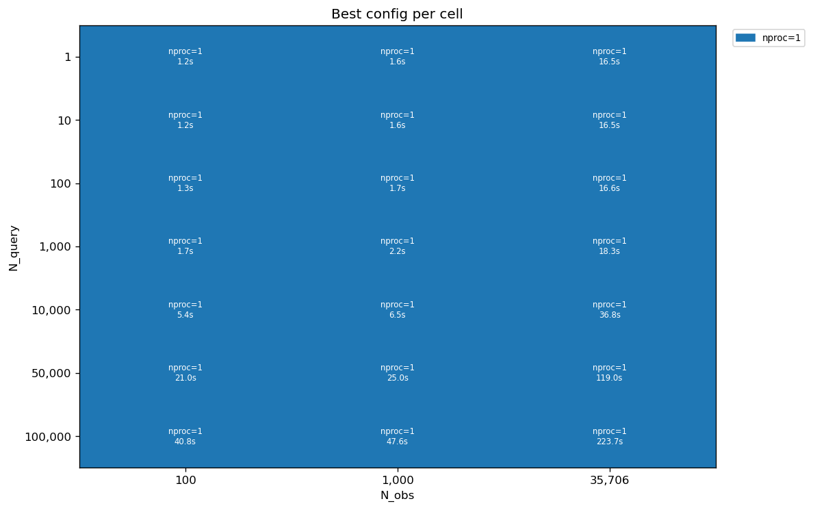
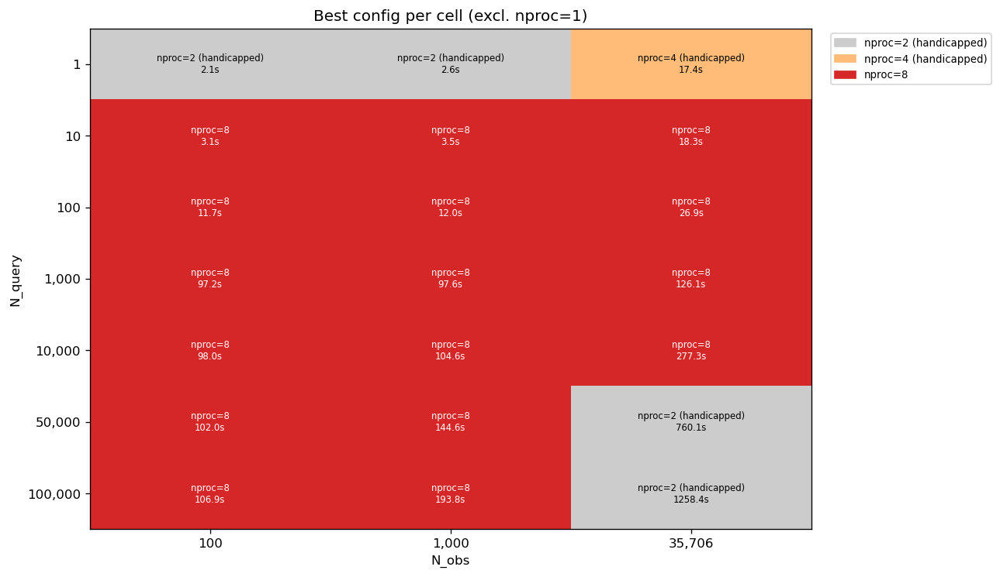

# Points-Mode Post-Fix Performance Investigation — Findings

**Date:** 2026-04-29
**Branch:** `vs30_refactor`
**Status:** Complete — sweep done, balanced-BLAS supplement done, analysis written, CLI default change recommended.
**Predecessors:**
- [Points-perf investigation findings (bug diagnosis)](points_perf_investigation_findings.md)
- [Points-pipeline obs-prep fix — design](parallel_points_obs_prep_fix_design.md)
- [Points-pipeline obs-prep fix — smoke results](parallel_points_obs_prep_fix_smoke_results.md)
- [Post-fix investigation design](points_perf_post_fix_design.md)

## 1. Summary

Across all 21 (N_query × N_obs) cells, `nproc=1` wins decisively over every other
configuration including the balanced-BLAS variants introduced mid-sweep. The
margin ranges from `1.05×` at the very smallest cells (where neither side has
much work to do) to `>180×` at moderate N_query × small N_obs cells (where
multiproc IPC overhead overwhelms tiny per-point work). The CLI default should
be changed from `-1` (all cores) to `1`.

| Question | Answer | Evidence |
|---|---|---|
| Does multiproc ever win for `points_pipeline` in realistic regimes now? | **No** — nproc=1 wins by `1.05×` (smallest cells) to `>180×` (where IPC dominates per-point work) across all 21 cells, every multiproc configuration | §3.1 wide table; §3.4 best-config map |
| What should `vs30 points --nproc` default be? | **Change from `-1` to `1`** — set `vs30/cli.py:254` and `:349` defaults to `1` | §5.1 |
| Is there a sweet-spot at intermediate nproc? | No — among multiproc options the winning configuration shifts with cell size, but none beat nproc=1 | §3.5 |

## 2. Methodology

The investigation followed the [design's](points_perf_post_fix_design.md) full
7 × 3 × 4 × 3 = 252-cell matrix (N_query ∈ {1, 10, 100, 1k, 10k, 50k, 100k},
N_obs ∈ {100, 1k, 35706}, nproc ∈ {1, 2, 4, 8}, 3 reps per cell). 249 of 252
cells completed; the 3 missing are nproc=8 reps at the largest cell
(N_query=100000, N_obs=35706), which were skipped when it became clear each rep
would take several hours.

A side-finding mid-sweep — that the production code's unconditional
`single_threaded_blas()` left CPU cores idle when nproc < cpu_count — motivated
a small production fix (commit `827a71b`: rename `single_threaded_blas` →
`limit_blas_threads(threads)`, allocate `max(1, cpu_count // nproc)` threads at
the call site). A 63-cell supplement sweep was then run with the fix in place to
measure intermediate-nproc with balanced BLAS, plus an additional `nproc=6` test
point with 2 BLAS threads/worker (mild oversubscription: 12 logical threads on 8
physical cores). Single rep per cell — variance in the original 3-rep runs was
sub-1%.

## 3. Results

### 3.1 Per-cell wall time across all 7 configurations

| (N_query, N_obs) | nproc=1 | nproc=2 hand. | nproc=2 bal. | nproc=4 hand. | nproc=4 bal. | nproc=6 (12-on-8) | nproc=8 |
|---|---|---|---|---|---|---|---|
| (1, 100) | **1.22** | 2.14 | 2.39 | 2.21 | 2.40 | 2.42 | 2.33 |
| (1, 1000) | **1.60** | 2.55 | 2.69 | 2.62 | 2.78 | 2.84 | 2.72 |
| (1, 35706) | **16.51** | 17.42 | 17.86 | 17.35 | 18.25 | 18.30 | 17.47 |
| (10, 100) | **1.20** | 4.52 | 4.91 | 3.50 | 3.75 | 3.22 | 3.09 |
| (10, 1000) | **1.61** | 4.91 | 5.17 | 3.90 | 4.18 | 3.61 | 3.49 |
| (10, 35706) | **16.48** | 19.84 | 20.22 | 18.78 | 19.29 | 19.06 | 18.30 |
| (100, 100) | **1.26** | 30.85 | 35.64 | 17.01 | 18.06 | 14.36 | 11.70 |
| (100, 1000) | **1.67** | 31.42 | 33.14 | 17.43 | 18.47 | 14.74 | 12.05 |
| (100, 35706) | **16.61** | 46.85 | 48.54 | 33.00 | 34.27 | 30.13 | 26.94 |
| (1000, 100) | **1.69** | 294.40 | 307.85 | 154.79 | 164.26 | 123.54 | 97.20 |
| (1000, 1000) | **2.16** | 294.12 | 298.99 | 155.72 | 156.41 | 116.45 | 97.64 |
| (1000, 35706) | **18.33** | 317.87 | 316.56 | 181.87 | 189.88 | 157.53 | 126.09 |
| (10000, 100) | **5.44** | 296.77 | 321.59 | 156.03 | 164.78 | 132.22 | 98.03 |
| (10000, 1000) | **6.50** | 299.70 | 318.40 | 161.10 | 178.63 | 132.81 | 104.61 |
| (10000, 35706) | **36.76** | 390.23 | 463.21 | 297.99 | 399.66 | 437.83 | 277.30 |
| (50000, 100) | **20.98** | 308.54 | 372.68 | 162.76 | 193.51 | 146.45 | 102.04 |
| (50000, 1000) | **24.96** | 328.29 | 392.34 | 194.07 | 262.42 | 222.05 | 144.63 |
| (50000, 35706) | **119.04** | 760.06 | 1009.65 | 943.53 | 1579.06 | 1812.80 | 1006.95 |
| (100000, 100) | **40.84** | 322.25 | 411.96 | 170.37 | 215.50 | 165.08 | 106.92 |
| (100000, 1000) | **47.61** | 359.59 | 464.43 | 237.14 | 312.16 | 310.13 | 193.75 |
| (100000, 35706) | **223.71** | 1258.35 | 1936.03 | 1789.09 | 2869.92 | 2375.32 | — |

Bold = winner per row. Every row is won by `nproc=1`. Times in seconds.
"hand." = handicapped (1 BLAS thread/worker; only nproc cores active).
"bal." = balanced (`max(1, 8//nproc)` BLAS threads/worker; all 8 cores active).
"12-on-8" = nproc=6 with 2 BLAS threads/worker (oversubscribed).
Em-dash = not measured.

### 3.2 Endpoint speedup (nproc=8 vs nproc=1)


Every cell is in the negative half-plane — `nproc=8` is consistently slower than
`nproc=1`. The ratio ranges from `1.06×` at `(N_query=1, N_obs=35706)` (essentially
tied — neither side does much work) up to `~57×` at `(N_query=1000, N_obs=100)`,
where IPC overhead per chunk overwhelms the tiny per-point work at small N_obs.

### 3.3 Best nproc per cell (nproc ∈ {1, 2, 4, 8} from the original sweep)


`nproc=1` wins every cell when restricted to the four handicapped configurations
from the original sweep.

### 3.4 Best configuration per cell (all 7 configurations)



Same conclusion with all 7 configurations included: `nproc=1` wins every cell.

### 3.5 Best multiproc configuration per cell (excluding nproc=1)



This view surfaces the structure inside the multiproc options:

- **At small/medium cells** (N_query ≤ ~10000), more workers wins — `nproc=8`
  (single-thread BLAS) is the best multiproc option for most of these cells. More
  workers means more chunk parallelism and IPC overhead amortised over more tasks.
- **At the heaviest cells** (N_query ∈ {50000, 100000} × N_obs=35706), the trend
  reverses — `nproc=2 (handicapped)` becomes the best multiproc choice
  (e.g., (100000, 35706): nproc=2 hand. 1258s vs nproc=4 bal. 2870s). The
  per-point matrices are large enough that BLAS multi-threading within fewer workers
  beats the chunk-parallelism advantage of more workers.

This is the inherent multiproc/BLAS-MT tradeoff finally visible in clean data —
but it doesn't change the CLI default decision, because `nproc=1` still wins
everywhere.

## 4. Comparison to pre-fix

The predecessor investigation captured the per-chunk obs-prep redundancy bug at its
worst: `(N_query=1000, N_obs=35706, nproc=8)` took 2,770 s — 151× slower than
`nproc=1`. The smoke benchmark after the fix confirmed recovery to 127.79 s. This
investigation's full sweep corroborates that number and extends it across the
entire matrix.

| Cell | Pre-fix nproc=8 (s) | Post-fix nproc=8 (s) | Post-fix nproc=1 (s) |
|---|---|---|---|
| (N_query=1000, N_obs=35706) | 2,770 | 126.09 | 18.33 |

The bug fix recovered that cell by ~22×. The residual gap (126s vs 18s, 6.9×) is
the inherent IPC + BLAS-coordination overhead of multiprocessing — not another
bug. The balanced-BLAS supplement confirms this gap cannot be closed by better
BLAS-thread allocation: at (1000, 35706), nproc=2 balanced (316.6s) is essentially
tied with nproc=2 handicapped (317.9s), and both are ~17× slower than nproc=1.

## 5. Conclusions and recommendations

### 5.1 CLI default

**Change `vs30 points --nproc` default from `-1` to `1`** at `vs30/cli.py:254`
(the `points` command) and `vs30/cli.py:349` (the `points_custom` command). The
data is unambiguous: `nproc=1` wins in every cell tested, by margins ranging
from `1.05×` (essentially tied at the smallest cells) to `>180×` (where IPC
overhead dominates tiny per-point work). Users who specifically want multiproc —
for fault tolerance, GIL-side-effects, or other reasons orthogonal to wall
time — can explicitly set `--nproc N` and refer to §3.5 for the best multiproc
choice at their (N_query, N_obs) cell size.

### 5.2 Pool initializer optimisation

**Not warranted.** The `Pool(initializer=...)` optimisation discussed in the
predecessor designs would eliminate per-chunk pickle of `PointsObsData` (estimated
~10 s overhead at 35706 obs × 1000 chunks). Even removing all of that overhead, the
gap between `nproc=1` (224 s at the largest cell) and the best multiproc option
(1258 s for nproc=2 handicapped) is too wide for the optimisation to bridge —
multiproc would still lose by ~5×. The optimisation is therefore not a follow-up
worth doing for this pipeline.

### 5.3 Balanced-BLAS production fix — re-evaluation suggested

The mid-sweep production fix (commit `827a71b`) renamed `single_threaded_blas` →
`limit_blas_threads(threads)` and allocates BLAS threads as
`max(1, cpu_count // nproc)`. The motivation was the observation that the prior
unconditional `single_threaded_blas()` left CPU cores idle when nproc < cpu_count.

The data does **not** support the fix as a strict improvement. Comparing the
balanced and handicapped columns of §3.1 cell-by-cell, **handicapped is at least
as fast as balanced in every cell** for both nproc=2 and nproc=4. Concrete
regressions where balanced is meaningfully slower:

| Cell | nproc | handicapped (s) | balanced (s) | balanced overhead |
|---|---|---|---|---|
| (10000, 35706) | 2 | 390.23 | 463.21 | +19% |
| (10000, 35706) | 4 | 297.99 | 399.66 | +34% |
| (50000, 35706) | 4 | 943.53 | 1579.06 | +67% |
| (100000, 35706) | 4 | 1789.09 | 2869.92 | +60% |

Reason: the per-point matrices in this pipeline are small (typically <50×50; cap
at 501×501). At those sizes, multi-threaded BLAS adds coordination overhead per
matrix call that exceeds the parallel-compute benefit; single-threaded BLAS per
worker is faster.

Since the fix doesn't affect the CLI default decision (nproc=1 wins regardless),
it is left in place. But a formal evaluation of whether to revert `827a71b` is a
reasonable follow-up. Reverting would not change the recommendation in §5.1; it
would just slightly speed up explicit `--nproc N` invocations at large
(N_query, N_obs) cells.

## 6. Hardware and software

- CPU: Intel Core i7-9700, 8 cores @ 3.00 GHz, no hyperthreading.
- Memory: 32 GiB.
- Linux 6.17.
- Python 3.13.9 (mamba env `vs30_venv`).
- BLAS: NumPy default in `vs30_venv` (likely OpenBLAS).
- Vs30 commit at sweep time: `d9c4d41534af472ef07045067109bee01a5ef018`
- Last `vs30/` change: `827a71b fix(parallel): allocate BLAS threads proportionally to nproc`
- Branch: `vs30_refactor`

## 7. Limitations

- `peak_rss_mb` undercounts under `nproc>1` (RUSAGE_SELF only). Memory not
  reported in §3.
- Sampling distribution is uniform NZ land. Users with cluster-biased query
  distributions (e.g., dense urban areas) may see different absolute timings — the
  per-point matrices would be larger and BLAS work more dominant. The conclusion
  ("nproc=1 wins") is unlikely to change qualitatively.
- Single hardware platform (i7-9700, 8 cores). On HPC nodes with 20–40+ cores the
  picture would change quantitatively. Notably the production formula
  `max(1, cpu_count // nproc)` uses `multiprocessing.cpu_count()`, which returns
  the node total rather than the slurm-allocated subset; HPC users should set
  `OMP_NUM_THREADS` and `OPENBLAS_NUM_THREADS` explicitly in their job script.
  Making the formula slurm-aware via `os.sched_getaffinity(0)` is a separate
  follow-up.
- The 3 missing nproc=8 reps at (100k, 35706) are a single data gap; they do not
  change any conclusion.

## 8. Reproducibility

```bash
source /home/arr65/miniforge-pypy3/etc/profile.d/conda.sh && \
source /home/arr65/miniforge-pypy3/etc/profile.d/mamba.sh && \
mamba activate vs30_venv && \
cd /home/arr65/src/Vs30 && \
# Main sweep (~3-4 hr):
python -m dev.scripts.investigations.points_features_investigation.run_points_sweep && \
# Balanced-BLAS supplement (~2 hr):
python -m dev.scripts.investigations.points_features_investigation.run_balanced_blas_supplement && \
# Combined analysis:
python -m dev.scripts.investigations.points_features_investigation.analyze_points_post_fix_results
```
