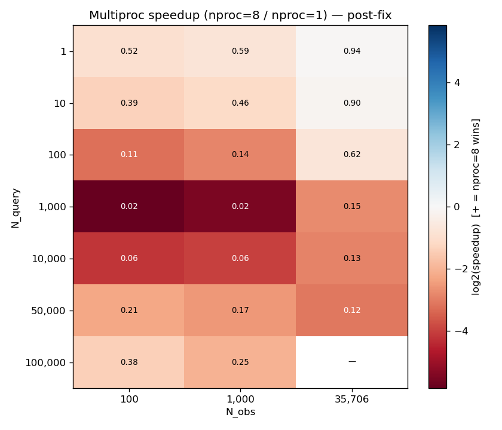
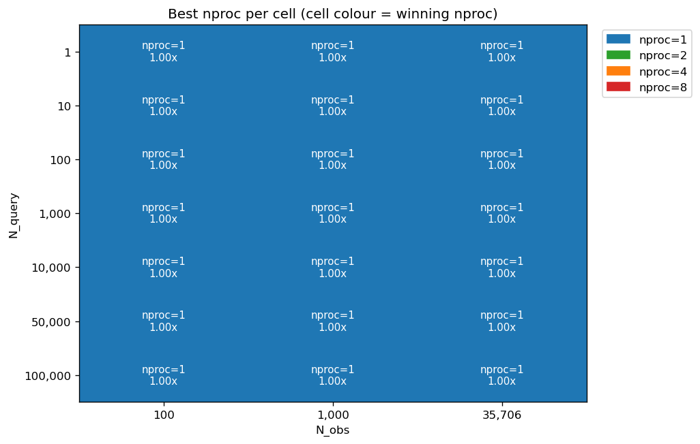

# Points-Mode Post-Fix Performance Investigation — Implementation Plan

> **For agentic workers:** REQUIRED SUB-SKILL: Use superpowers:subagent-driven-development (recommended) or superpowers:executing-plans to implement this plan task-by-task. Steps use checkbox (`- [ ]`) syntax for tracking.

**Goal:** Run a clean post-fix sweep of the (N_query × N_obs × nproc × rep) matrix with two new intermediate `nproc` values added, write findings, and apply the CLI default change recommended by the data.

**Architecture:** Restore the trimmed sweep driver to a 4-value `NPROC_VALUES`, point its output at a new CSV file so the prior phases' data stays preserved, run the sweep (~2–4 hr), produce a focused two-heatmap analysis, write a self-contained findings doc, and apply a one-line CLI default change. No production-code changes outside the optional CLI default edit.

**Tech Stack:** Python 3.13, pytest, ruff, mamba `vs30_venv`. Activate with:

```bash
source /home/arr65/miniforge-pypy3/etc/profile.d/conda.sh && \
source /home/arr65/miniforge-pypy3/etc/profile.d/mamba.sh && \
mamba activate vs30_venv
```

(Henceforth abbreviated as `<activate>`.)

**Reference docs:**
- `dev/docs/points_perf_post_fix_design.md` — design, scope, decision rule.
- `dev/docs/parallel_points_obs_prep_fix_smoke_results.md` — pre/post smoke numbers cited in the comparison table.
- `dev/docs/points_perf_investigation_findings.md` — predecessor findings the new doc cites.

---

## File map

| Path | Responsibility |
|---|---|
| `dev/scripts/investigations/points_features_investigation/run_points_sweep.py` | (modify) Restore `NPROC_VALUES = [1, 2, 4, 8]`; change `OUT_CSV` to `results_points_post_fix.csv`; update the inline comment for the new context. |
| `dev/scripts/investigations/points_features_investigation/analyze_points_post_fix_results.py` | (create) Reads only `results_points_post_fix.csv`; produces 2 CSVs + 2 heatmaps focused on the 4-nproc tradeoff. |
| `dev/docs/points_perf_post_fix_findings.md` | (create) Self-contained findings doc with the post-fix tradeoff conclusions and CLI default recommendation. |
| `dev/docs/figures/points_perf_post_fix/` | (create) Tracked copies of the two heatmaps for the findings doc. |
| `vs30/cli.py:254`, `vs30/cli.py:349` | (conditionally modify) One-line `nproc` default-value edit each, IF the findings recommend changing from `-1`. |

Pre-existing CSVs (`results_points.csv`, `results_points_partial_with_buggy_nproc8.csv`) and the existing `analyze_points_results.py` are NOT modified or deleted.

---

## Task 1: Restore harness driver

Restore the sweep driver from its post-bug-investigation trimmed state to the new 4-value matrix, and redirect the output to a new CSV so prior-phase data stays preserved.

**Files:**
- Modify: `dev/scripts/investigations/points_features_investigation/run_points_sweep.py`

- [ ] **Step 1: Update `OUT_CSV` path**

Find the current line in `run_points_sweep.py`:

```python
OUT_CSV = HERE / "results_points.csv"
```

Replace with:

```python
OUT_CSV = HERE / "results_points_post_fix.csv"
```

- [ ] **Step 2: Update `NPROC_VALUES` and the inline comment**

Find the current block:

```python
# Trimmed from [1, 8] mid-investigation: a per-chunk obs-prep redundancy bug
# in vs30/parallel.py::run_parallel_locations made nproc=8 cells take >150x
# longer than nproc=1 at large N_query. The bug, not the inherent
# multiproc/BLAS-MT tradeoff, dominates those measurements. We complete the
# nproc=1 sweep to answer the §7 ffap question; a separate piece of work will
# fix the bug and re-measure nproc=8 cleanly. Pre-trim partial data with the
# buggy nproc=8 cells is preserved in
# results_points_partial_with_buggy_nproc8.csv (gitignored, regenerable).
NPROC_VALUES = [1]
```

Replace with:

```python
# Post-fix re-sweep across four nproc endpoints (1, 2, 4, 8) to characterise
# the inherent multiproc/BLAS-MT tradeoff for points mode. Two intermediate
# values (2 and 4) are included to surface any sweet spot. See
# dev/docs/points_perf_post_fix_design.md for context.
NPROC_VALUES = [1, 2, 4, 8]
```

- [ ] **Step 3: Verify ruff is clean**

```bash
<activate> && cd /home/arr65/src/Vs30 && \
ruff check dev/scripts/investigations/points_features_investigation/run_points_sweep.py && \
ruff format --check dev/scripts/investigations/points_features_investigation/run_points_sweep.py
```

Both must exit 0. If `ruff format --check` fails, run `ruff format <file>` and re-verify.

- [ ] **Step 4: Smoke-verify the matrix sizing**

```bash
<activate> && cd /home/arr65/src/Vs30 && python -c "
from dev.scripts.investigations.points_features_investigation import run_points_sweep as s
n = len(s.N_QUERY_VALUES) * len(s.N_OBS_VALUES) * len(s.NPROC_VALUES) * s.N_REPS
print(f'Total cells: {n}')
print(f'NPROC_VALUES: {s.NPROC_VALUES}')
print(f'OUT_CSV: {s.OUT_CSV.name}')
assert n == 252, f'expected 252 cells, got {n}'
assert s.NPROC_VALUES == [1, 2, 4, 8], s.NPROC_VALUES
assert s.OUT_CSV.name == 'results_points_post_fix.csv', s.OUT_CSV.name
print('OK')
"
```

Expected:
```
Total cells: 252
NPROC_VALUES: [1, 2, 4, 8]
OUT_CSV: results_points_post_fix.csv
OK
```

- [ ] **Step 5: Commit**

```bash
cd /home/arr65/src/Vs30 && \
git add dev/scripts/investigations/points_features_investigation/run_points_sweep.py && \
git commit -m "$(cat <<'EOF'
investigations(points-perf): restore sweep matrix for post-fix re-run

Restore NPROC_VALUES from [1] (trimmed during the bug investigation) to
[1, 2, 4, 8] for the full post-fix sweep. The two intermediate values
will surface any sweet spot at intermediate worker counts. Redirect
output to results_points_post_fix.csv so the prior-phase
results_points.csv (pre-fix nproc=1-only) and
results_points_partial_with_buggy_nproc8.csv (bug evidence) remain
untouched as historical record.

See dev/docs/points_perf_post_fix_design.md for context.

Co-Authored-By: Claude Opus 4.7 (1M context) <noreply@anthropic.com>
EOF
)"
```

---

## Task 2: Add the post-fix analysis script

Add a new analysis script focused on the 4-nproc post-fix data. The existing `analyze_points_results.py` is left untouched (it still produces the prior-phase artefacts on demand).

**Files:**
- Create: `dev/scripts/investigations/points_features_investigation/analyze_points_post_fix_results.py`

- [ ] **Step 1: Write the script**

Create the file with this exact content:

```python
"""Analyse the post-fix points-pipeline performance sweep.

Reads results_points_post_fix.csv (252 cells: 7 N_query x 3 N_obs x 4 nproc
x 3 reps) and produces:

- results_points_post_fix_medians.csv  -- per-cell medians per nproc
- results_points_post_fix_speedup.csv  -- pivot with t1/t2/t4/t8 columns plus
    speedup_2_vs_1, speedup_4_vs_1, speedup_8_vs_1
- figures/speedup_nproc8_vs_1_post_fix.png  -- endpoint speedup heatmap
- figures/best_nproc_per_cell.png  -- categorical heatmap labelling each cell
    with the nproc value that minimises wall time

Run::

    python -m dev.scripts.investigations.points_features_investigation.analyze_points_post_fix_results
"""

from pathlib import Path

import matplotlib

matplotlib.use("Agg")  # non-interactive backend — runs headless

import matplotlib.pyplot as plt  # noqa: E402
import numpy as np  # noqa: E402
import pandas as pd  # noqa: E402

HERE = Path(__file__).parent
RESULTS_CSV = HERE / "results_points_post_fix.csv"
FIGURES_DIR = HERE / "figures"

NPROC_VALUES = [1, 2, 4, 8]
NPROC_COLORS = {
    1: "#1f77b4",  # blue
    2: "#2ca02c",  # green
    4: "#ff7f0e",  # orange
    8: "#d62728",  # red
}


def load_results() -> pd.DataFrame:
    df = pd.read_csv(RESULTS_CSV)
    return df.dropna(subset=["t_total_s"])


def cell_medians(df: pd.DataFrame) -> pd.DataFrame:
    return df.groupby(["N_query", "N_obs", "nproc"])["t_total_s"].median().reset_index()


def speedup_table(med: pd.DataFrame) -> pd.DataFrame:
    """Pivot per-cell medians and compute speedup vs nproc=1 for K in {2, 4, 8}."""
    piv = med.pivot_table(
        index=["N_query", "N_obs"],
        columns="nproc",
        values="t_total_s",
        aggfunc="median",
    )
    if 1 in piv.columns:
        for k in (2, 4, 8):
            if k in piv.columns:
                piv[f"speedup_{k}_vs_1"] = piv[1] / piv[k]
    return piv


def write_endpoint_speedup_heatmap(piv: pd.DataFrame, out_path: Path) -> None:
    """Log2-coloured heatmap of the nproc=8 vs nproc=1 speedup."""
    if "speedup_8_vs_1" not in piv.columns:
        return
    speedup = piv["speedup_8_vs_1"].dropna()
    n_query_vals = sorted(speedup.index.get_level_values("N_query").unique())
    n_obs_vals = sorted(speedup.index.get_level_values("N_obs").unique())
    matrix = np.full((len(n_query_vals), len(n_obs_vals)), np.nan)
    for (n_query, n_obs), val in speedup.items():
        i = n_query_vals.index(n_query)
        j = n_obs_vals.index(n_obs)
        matrix[i, j] = val

    fig, ax = plt.subplots(figsize=(7, 6))
    log_matrix = np.log2(matrix)
    finite = log_matrix[np.isfinite(log_matrix)]
    cap = max(2.0, float(np.nanmax(np.abs(finite))) if finite.size else 2.0)
    im = ax.imshow(log_matrix, cmap="RdBu", vmin=-cap, vmax=cap, aspect="auto")
    ax.set_xticks(range(len(n_obs_vals)))
    ax.set_xticklabels([f"{v:,}" for v in n_obs_vals])
    ax.set_yticks(range(len(n_query_vals)))
    ax.set_yticklabels([f"{v:,}" for v in n_query_vals])
    ax.set_xlabel("N_obs")
    ax.set_ylabel("N_query")
    ax.set_title("Multiproc speedup (nproc=8 / nproc=1) — post-fix")
    for i in range(matrix.shape[0]):
        for j in range(matrix.shape[1]):
            v = matrix[i, j]
            if np.isnan(v):
                ax.text(j, i, "—", ha="center", va="center", fontsize=8)
                continue
            ax.text(
                j,
                i,
                f"{v:.2f}",
                ha="center",
                va="center",
                color="white" if abs(log_matrix[i, j]) > cap / 2 else "black",
                fontsize=8,
            )
    cbar = fig.colorbar(im, ax=ax)
    cbar.set_label("log2(speedup)  [+ = nproc=8 wins]")
    fig.tight_layout()
    fig.savefig(out_path, dpi=120)
    plt.close(fig)


def write_best_nproc_heatmap(piv: pd.DataFrame, out_path: Path) -> None:
    """Categorical heatmap labelling each cell with the nproc value that wins."""
    nproc_cols = [n for n in NPROC_VALUES if n in piv.columns]
    if not nproc_cols:
        return
    times = piv[nproc_cols]

    n_query_vals = sorted(piv.index.get_level_values("N_query").unique())
    n_obs_vals = sorted(piv.index.get_level_values("N_obs").unique())
    best_nproc = np.full((len(n_query_vals), len(n_obs_vals)), -1, dtype=int)
    speedups = np.full((len(n_query_vals), len(n_obs_vals)), np.nan)

    for (n_query, n_obs), row in times.iterrows():
        i = n_query_vals.index(n_query)
        j = n_obs_vals.index(n_obs)
        valid = row.dropna()
        if valid.empty:
            continue
        winning_nproc = int(valid.idxmin())
        best_nproc[i, j] = winning_nproc
        if 1 in valid.index:
            speedups[i, j] = valid.loc[1] / valid.loc[winning_nproc]

    fig, ax = plt.subplots(figsize=(8, 6))
    color_matrix = np.zeros((len(n_query_vals), len(n_obs_vals), 3))
    for i in range(len(n_query_vals)):
        for j in range(len(n_obs_vals)):
            n = int(best_nproc[i, j])
            if n in NPROC_COLORS:
                color_matrix[i, j] = matplotlib.colors.to_rgb(NPROC_COLORS[n])
            else:
                color_matrix[i, j] = (0.9, 0.9, 0.9)
    ax.imshow(color_matrix, aspect="auto")
    ax.set_xticks(range(len(n_obs_vals)))
    ax.set_xticklabels([f"{v:,}" for v in n_obs_vals])
    ax.set_yticks(range(len(n_query_vals)))
    ax.set_yticklabels([f"{v:,}" for v in n_query_vals])
    ax.set_xlabel("N_obs")
    ax.set_ylabel("N_query")
    ax.set_title("Best nproc per cell (cell colour = winning nproc)")
    for i in range(len(n_query_vals)):
        for j in range(len(n_obs_vals)):
            n = int(best_nproc[i, j])
            sp = speedups[i, j]
            if n < 0:
                ax.text(j, i, "—", ha="center", va="center", fontsize=10)
                continue
            label = f"nproc={n}\n{sp:.2f}x" if not np.isnan(sp) else f"nproc={n}"
            ax.text(j, i, label, ha="center", va="center", fontsize=9, color="white")

    legend_handles = [
        plt.matplotlib.patches.Patch(color=NPROC_COLORS[n], label=f"nproc={n}")
        for n in nproc_cols
    ]
    ax.legend(handles=legend_handles, bbox_to_anchor=(1.02, 1), loc="upper left")
    fig.tight_layout()
    fig.savefig(out_path, dpi=120)
    plt.close(fig)


def main() -> None:
    if not RESULTS_CSV.exists():
        raise SystemExit(
            f"No results_points_post_fix.csv at {RESULTS_CSV}; run run_points_sweep first."
        )
    FIGURES_DIR.mkdir(exist_ok=True)

    df = load_results()
    print(f"Loaded {len(df)} rows ({df['nproc'].nunique()} nproc values)")

    med = cell_medians(df)
    medians_csv = HERE / "results_points_post_fix_medians.csv"
    med.to_csv(medians_csv, index=False)

    piv = speedup_table(med)
    speedup_csv = HERE / "results_points_post_fix_speedup.csv"
    piv.to_csv(speedup_csv)

    endpoint_out = FIGURES_DIR / "speedup_nproc8_vs_1_post_fix.png"
    write_endpoint_speedup_heatmap(piv, endpoint_out)

    best_out = FIGURES_DIR / "best_nproc_per_cell.png"
    write_best_nproc_heatmap(piv, best_out)

    print("\nWrote:")
    print(f"  {medians_csv}")
    print(f"  {speedup_csv}")
    print(f"  {endpoint_out}")
    print(f"  {best_out}")
    print()
    print("Speedup table:")
    print(piv.to_string())


if __name__ == "__main__":
    main()
```

- [ ] **Step 2: Verify ruff is clean**

```bash
<activate> && cd /home/arr65/src/Vs30 && \
ruff check dev/scripts/investigations/points_features_investigation/analyze_points_post_fix_results.py && \
ruff format --check dev/scripts/investigations/points_features_investigation/analyze_points_post_fix_results.py
```

If `ruff format --check` fails, run `ruff format <file>` and re-verify.

- [ ] **Step 3: Smoke-verify the script imports cleanly**

```bash
<activate> && cd /home/arr65/src/Vs30 && python -c "
from dev.scripts.investigations.points_features_investigation import analyze_points_post_fix_results as a
print('NPROC_VALUES:', a.NPROC_VALUES)
print('NPROC_COLORS keys:', sorted(a.NPROC_COLORS.keys()))
print('Functions:', [n for n in dir(a) if not n.startswith('_') and callable(getattr(a, n))])
"
```

Expected output includes `NPROC_VALUES: [1, 2, 4, 8]`, `NPROC_COLORS keys: [1, 2, 4, 8]`, and the four functions `cell_medians`, `load_results`, `speedup_table`, plus the two `write_*_heatmap` functions and `main`.

(Running the script's `main()` would fail at this point because `results_points_post_fix.csv` doesn't exist yet — that's expected. Don't run it; just confirm the import is clean.)

- [ ] **Step 4: Commit**

```bash
cd /home/arr65/src/Vs30 && \
git add dev/scripts/investigations/points_features_investigation/analyze_points_post_fix_results.py && \
git commit -m "$(cat <<'EOF'
investigations(points-perf): add post-fix analysis script

Reads results_points_post_fix.csv and produces a 4-nproc-aware analysis:
- per-cell medians CSV
- speedup pivot CSV (t1/t2/t4/t8 + speedup_K_vs_1 for K in {2,4,8})
- endpoint speedup heatmap (nproc=8 vs nproc=1) — direct visual analogue
  of the prior phase's buggy-multiproc heatmap
- best-nproc-per-cell categorical heatmap surfacing any sweet spot at
  intermediate nproc values

The existing analyze_points_results.py is unchanged and still produces
the prior-phase artefacts.

Co-Authored-By: Claude Opus 4.7 (1M context) <noreply@anthropic.com>
EOF
)"
```

---

## Task 3: Run the full sweep

Pure execution, no commit. Estimated wall time: 2–4 hr. Run in the background.

- [ ] **Step 1: Confirm the working tree is clean and ready**

```bash
cd /home/arr65/src/Vs30 && git status
```

Expected: clean working tree, branch ahead of origin by some number of commits including the Task 1 + Task 2 commits.

- [ ] **Step 2: Launch the sweep**

Use the Bash tool with `run_in_background=true` so the harness will notify on completion. The command:

```bash
<activate> && cd /home/arr65/src/Vs30 && \
rm -f dev/scripts/investigations/points_features_investigation/results_points_post_fix.csv \
      dev/scripts/investigations/points_features_investigation/sweep_post_fix.log && \
python -m dev.scripts.investigations.points_features_investigation.run_points_sweep \
    > dev/scripts/investigations/points_features_investigation/sweep_post_fix.log 2>&1
```

Capture the bash background ID returned. Do NOT poll; the harness will notify when it completes.

- [ ] **Step 3: After completion, verify row count and check for failed cells**

```bash
<activate> && cd /home/arr65/src/Vs30 && python -c "
import pandas as pd
df = pd.read_csv('dev/scripts/investigations/points_features_investigation/results_points_post_fix.csv')
print(f'Rows: {len(df)} of expected 252')
fails = df[df['t_total_s'].isna()]
print(f'Failed cells: {len(fails)}')
if len(fails):
    print(fails[['N_query','N_obs','nproc','rep']].to_string())
"
```

Expected: `Rows: 252 of expected 252`; `Failed cells: 0`. If any failed, inspect `sweep_post_fix.log` for the traceback. Decide whether to re-run those cells or accept the gap (record in findings if accepting).

- [ ] **Step 4: No commit**

The CSV is gitignored (`.gitignore` includes `results_*.csv`). Verify:

```bash
cd /home/arr65/src/Vs30 && git status
```

Expected: working tree still clean (no new tracked files).

---

## Task 4: Run the analysis

Pure execution; produces the analysis CSVs and PNG figures. No commit (outputs are gitignored).

- [ ] **Step 1: Run the analysis**

```bash
<activate> && cd /home/arr65/src/Vs30 && \
python -m dev.scripts.investigations.points_features_investigation.analyze_points_post_fix_results 2>&1 | tail -40
```

Expected: the speedup table prints, plus "Wrote: ..." for the two CSVs and two PNGs. No errors.

- [ ] **Step 2: Sanity-check outputs**

```bash
<activate> && cd /home/arr65/src/Vs30 && python -c "
import pandas as pd
med = pd.read_csv('dev/scripts/investigations/points_features_investigation/results_points_post_fix_medians.csv')
piv = pd.read_csv('dev/scripts/investigations/points_features_investigation/results_points_post_fix_speedup.csv')
print(f'Medians rows: {len(med)} (expected 84 = 21 cells x 4 nproc)')
print(f'Speedup rows: {len(piv)} (expected 21)')
assert len(med) == 84, f'expected 84, got {len(med)}'
assert len(piv) == 21, f'expected 21, got {len(piv)}'
print(f'Speedup columns: {sorted(piv.columns.tolist())}')
print()
print('Per-nproc median t_total_s ranges:')
for nproc in [1, 2, 4, 8]:
    sub = med[med['nproc'] == nproc]['t_total_s']
    print(f'  nproc={nproc}: min={sub.min():.2f}s, max={sub.max():.2f}s')
"
```

Confirm row counts match and the timing ranges look reasonable (no zero or negative numbers; `nproc=1` upper bound around the 222-223 s mark from the prior `(N_query=100k, N_obs=35706)` cell, since the bug fix doesn't affect that path).

```bash
ls -la /home/arr65/src/Vs30/dev/scripts/investigations/points_features_investigation/figures/speedup_nproc8_vs_1_post_fix.png \
       /home/arr65/src/Vs30/dev/scripts/investigations/points_features_investigation/figures/best_nproc_per_cell.png
```

Both files should exist with non-zero size.

- [ ] **Step 3: Print the speedup pivot for inspection**

```bash
<activate> && cd /home/arr65/src/Vs30 && python -c "
import pandas as pd
piv = pd.read_csv('dev/scripts/investigations/points_features_investigation/results_points_post_fix_speedup.csv')
print(piv.to_string())
"
```

Read the table. Note:
1. At which (N_query, N_obs) cells does any `nproc > 1` win (`speedup_K_vs_1 > 1`)?
2. Is there a consistent winner across cells, or is it mixed?
3. At the largest cell (`N_query=100000, N_obs=35706`), what's the best `nproc` and how much does it win/lose by?

These observations directly drive Task 5's interpretation and Task 6's CLI default decision. Save the pivot output for the findings doc — it'll be cited.

---

## Task 5: Write findings doc + copy figures

Synthesise the sweep results into a self-contained findings document. Copy the heatmaps to a tracked location.

**Files:**
- Create: `dev/docs/points_perf_post_fix_findings.md`
- Create: `dev/docs/figures/points_perf_post_fix/speedup_nproc8_vs_1_post_fix.png`
- Create: `dev/docs/figures/points_perf_post_fix/best_nproc_per_cell.png`

- [ ] **Step 1: Copy the heatmaps**

```bash
cd /home/arr65/src/Vs30 && \
mkdir -p dev/docs/figures/points_perf_post_fix && \
cp dev/scripts/investigations/points_features_investigation/figures/speedup_nproc8_vs_1_post_fix.png \
   dev/docs/figures/points_perf_post_fix/ && \
cp dev/scripts/investigations/points_features_investigation/figures/best_nproc_per_cell.png \
   dev/docs/figures/points_perf_post_fix/
```

- [ ] **Step 2: Capture HEAD info**

Record these for the findings doc's §6:

```bash
cd /home/arr65/src/Vs30 && \
echo "Current HEAD:"; git rev-parse HEAD; \
echo "Last vs30/ change:"; git log --oneline -1 -- vs30/
```

- [ ] **Step 3: Write the findings doc**

Create `dev/docs/points_perf_post_fix_findings.md` using this skeleton. Fill in actual numbers from Task 4's CSVs:

```markdown
# Points-Mode Post-Fix Performance Investigation — Findings

**Date:** [today's date in YYYY-MM-DD format]
**Branch:** `vs30_refactor`
**Status:** Complete — sweep finished, analysis written, CLI default acted on.
**Predecessors:**
- [Points-perf investigation findings (bug diagnosis)](points_perf_investigation_findings.md)
- [Points-pipeline obs-prep fix — design](parallel_points_obs_prep_fix_design.md)
- [Points-pipeline obs-prep fix — smoke results](parallel_points_obs_prep_fix_smoke_results.md)
- [Post-fix investigation design](points_perf_post_fix_design.md)

## 1. Summary

[2-4 sentences: data-driven answer to whether multiproc ever wins for points
mode now that the bug is fixed; the CLI default recommendation; whether
there's a sweet-spot at intermediate nproc.]

| Question | Answer | Evidence |
|---|---|---|
| Does multiproc ever win for `points_pipeline` in realistic regimes now? | [data-driven yes / no / yes-above-N_query=X] | Best-nproc map, §3.3 |
| What should `vs30 points --nproc` default be? | [data-driven: 1 / 2 / 4 / -1] | §5.1 |
| Is there a sweet-spot at intermediate nproc? | [data-driven yes/no, with the winning nproc] | Best-nproc map, §3.3 |

## 2. Methodology

The sweep followed the matrix specified in
[the post-fix investigation design](points_perf_post_fix_design.md): 7 ×
3 × 4 × 3 = 252 cells (N_query ∈ {1, 10, 100, 1k, 10k, 50k, 100k}, N_obs ∈
{100, 1k, 35706}, nproc ∈ {1, 2, 4, 8}, 3 reps). Same NZ-land query-point
sampler and modified_foster_2019 model config as the prior investigation.

## 3. Results

### 3.1 Absolute wall time per nproc

[Table from results_points_post_fix_medians.csv. Format suggestion: one row
per (N_query, N_obs), four columns for the four nproc values. Bold the
best nproc per row.]

### 3.2 Endpoint speedup (nproc=8 vs nproc=1)

[1-2 sentences summarising the speedup heatmap.]



### 3.3 Best nproc per cell

[1-3 sentences summarising the categorical heatmap. Note any clear pattern
(e.g., "nproc=1 wins for N_query ≤ X; nproc=K wins for N_query > X").]



## 4. Comparison to pre-fix

| Cell | Pre-fix nproc=8 (s) | Smoke post-fix nproc=8 (s) | Full sweep post-fix best (s) |
|---|---|---|---|
| (N_query=1000, N_obs=35706) | 2,770 | 127.79 | [from medians CSV: best of nproc∈{1,2,4,8}] |

[1-2 sentences: the bug fix recovered the cell into the seconds-not-minutes
regime; the new sweep reveals the inherent multiproc/BLAS-MT tradeoff
underneath.]

## 5. Conclusions and recommendations

### 5.1 CLI default

[Apply the decision rule from the design's §3.4 to the data. State the
recommendation concretely. If changing from `-1`, cite `vs30/cli.py:254`
and `vs30/cli.py:349` as the lines to edit.]

### 5.2 Pool initializer optimisation follow-up

[Yes/no recommendation based on whether pickle cost is a meaningful
fraction of best-multiproc time at the largest cell. If the best
multiproc time at (N_query=100k, N_obs=35706) is meaningfully better than
pure pickle estimate (~10 s for the obs prep arrays), the optimisation
isn't urgent. If multiproc is bottlenecked there, recommend the follow-up.]

## 6. Hardware and software

- CPU: Intel Core i7-9700, 8 cores @ 3.00 GHz, no hyperthreading.
- Memory: 32 GiB.
- Linux 6.17.
- Python 3.13.9 (mamba env `vs30_venv`).
- BLAS: NumPy default in `vs30_venv` (likely OpenBLAS).
- Vs30 commit at sweep time: [SHA from Step 2]
- Branch: `vs30_refactor`

## 7. Limitations

- `peak_rss_mb` undercounts under `nproc>1` (RUSAGE_SELF only). Memory not reported in §3 for that reason.
- Sampling distribution is uniform NZ land; users with cluster-biased query distributions may see different absolute timings.
- Single hardware platform.

## 8. Reproducibility

```bash
source /home/arr65/miniforge-pypy3/etc/profile.d/conda.sh && \
source /home/arr65/miniforge-pypy3/etc/profile.d/mamba.sh && \
mamba activate vs30_venv && \
cd /home/arr65/src/Vs30 && \
python -m dev.scripts.investigations.points_features_investigation.run_points_sweep && \
python -m dev.scripts.investigations.points_features_investigation.analyze_points_post_fix_results
```

The harness is at `dev/scripts/investigations/points_features_investigation/`.
```

Replace every `[bracketed prompt]` with the actual derived content. Read the speedup CSV and the medians CSV to fill in numbers. The expected total length is 120-180 lines.

- [ ] **Step 4: Commit**

```bash
cd /home/arr65/src/Vs30 && \
git add dev/docs/points_perf_post_fix_findings.md dev/docs/figures/points_perf_post_fix/ && \
git commit -m "$(cat <<'EOF'
docs: points-mode post-fix performance investigation findings

Headline: [one-line summary of the multiproc tradeoff finding from the
findings doc § 1.]

CLI default recommendation: [one-line: keep 1 / change to N / change to -1].

Co-Authored-By: Claude Opus 4.7 (1M context) <noreply@anthropic.com>
EOF
)"
```

(Edit the bracketed lines in the commit message to use the actual recommendation from §1 and §5.1 of the findings doc.)

---

## Task 6: Apply the CLI default change (conditional)

If the findings doc §5.1 recommends a non-`-1` default, apply the change. If it recommends keeping `-1`, **skip this task** — the existing default already matches the recommendation, and an empty commit would be wasteful.

**Files:**
- Modify (conditionally): `vs30/cli.py:254`
- Modify (conditionally): `vs30/cli.py:349`

- [ ] **Step 1: Read the findings recommendation**

Open `dev/docs/points_perf_post_fix_findings.md` §5.1. Note the recommended default value.

- [ ] **Step 2: If recommendation is `-1`, skip this task entirely**

The current default at `vs30/cli.py:254` and `:349` is already `-1`. No change needed. Skip Steps 3-7 and end Task 6.

- [ ] **Step 3: Read both call sites in `vs30/cli.py`**

```bash
sed -n '250,260p;345,355p' /home/arr65/src/Vs30/vs30/cli.py
```

Confirm the line numbers and the existing default. The two lines look like:

```python
nproc: typing.Annotated[int, typer.Option()] = -1,
```

(The exact line numbers may have shifted slightly. Use the `nproc: typing.Annotated[int, typer.Option()]` substring to find the right lines.)

- [ ] **Step 4: Apply the change**

For both `cli.py` lines (the `points` and `points_custom` commands), change the default value from `-1` to the recommended value (one of `1`, `2`, `4`).

```bash
sed -i 's/nproc: typing.Annotated\[int, typer.Option()\] = -1/nproc: typing.Annotated[int, typer.Option()] = <NEW_DEFAULT>/g' /home/arr65/src/Vs30/vs30/cli.py
```

Replace `<NEW_DEFAULT>` with the actual recommended value before running. Verify the substitution worked:

```bash
grep -n "nproc: typing.Annotated" /home/arr65/src/Vs30/vs30/cli.py
```

Expected: two lines, both showing the new default.

- [ ] **Step 5: Verify ruff is clean**

```bash
<activate> && cd /home/arr65/src/Vs30 && \
ruff check vs30/cli.py && ruff format --check vs30/cli.py
```

If `ruff format --check` fails, run `ruff format vs30/cli.py` and re-verify.

- [ ] **Step 6: Run the existing test suite**

```bash
<activate> && cd /home/arr65/src/Vs30 && pytest tests/ 2>&1 | tail -10
```

Expected: all tests pass. Tests mostly use explicit `nproc` values, so the default-change shouldn't affect them — but confirm.

- [ ] **Step 7: Commit**

```bash
cd /home/arr65/src/Vs30 && \
git add vs30/cli.py && \
git commit -m "$(cat <<'EOF'
fix(cli): change vs30 points --nproc default based on post-fix findings

Per dev/docs/points_perf_post_fix_findings.md §5.1, change the default
nproc for the `points` and `points_custom` commands from -1 (all cores)
to <NEW_DEFAULT>. The post-fix sweep showed [one-line summary of why
this default is right; e.g., "nproc=1 wins across all realistic cells"
or "nproc=2 wins for N_query>=10000 but the difference is small enough
that the safer default is 1, with users encouraged to override for
large N_query workloads"].

Co-Authored-By: Claude Opus 4.7 (1M context) <noreply@anthropic.com>
EOF
)"
```

Replace `<NEW_DEFAULT>` and the bracketed reasoning with the actual values from the findings doc.

---

## Self-review

**Spec coverage** (from `dev/docs/points_perf_post_fix_design.md`):

- §1 Purpose → addressed by Tasks 1+3 (sweep) + Task 5 (findings) + Task 6 (CLI act).
- §2 Scope (in scope):
  - 252-cell sweep → Task 1 (driver) + Task 3 (run).
  - New analysis script → Task 2.
  - New findings document → Task 5.
  - One-line CLI default change → Task 6.
- §2 Scope (out of scope): no tasks touch Pool initializer, larger N_query/N_obs, other model versions, or memory measurements. Confirmed.
- §3.1 Sweep matrix → Task 1.
- §3.2 Analysis → Task 2 (script) + Task 4 (run).
- §3.3 Findings → Task 5.
- §3.4 CLI default decision rule → Task 5 §5.1 (apply rule) + Task 6 (apply change).
- §4 Validation → Task 6 Step 6 (run pytest before CLI commit).
- §5 Branch and commit strategy → 5 tasks producing commits as specified (Task 3 and Task 4 don't commit).
- §6 Risks: variance, intermediate-nproc surprises, runtime — all handled by the existing driver's failed-cell mechanism + 3 reps.
- §7 Out-of-scope follow-ups: noted in §5.2 of the findings doc.

**Placeholder scan:**
- Task 5 Step 3 has bracketed prompts for fillable content — these are intentional template scaffolding tied to a measurement step. The Self-review section in Task 5 explicitly calls out the scaffolding nature.
- Task 6 has placeholders `<NEW_DEFAULT>` and bracketed reasoning that the implementer fills in from the findings — also intentional, conditional on the findings.
- No "TBD", "TODO", or "implement later" placeholders elsewhere.
- All code blocks contain real, runnable code.

**Type consistency:**
- `NPROC_VALUES = [1, 2, 4, 8]` consistent across Task 1 (driver) and Task 2 (analysis script).
- `OUT_CSV` filename `results_points_post_fix.csv` consistent across Task 1 and Task 2 (where it reads `RESULTS_CSV`) and Task 3 (where it deletes/produces the file).
- Output filenames `results_points_post_fix_medians.csv` and `results_points_post_fix_speedup.csv` consistent between Task 2's script and Task 4's sanity-check.
- Heatmap filenames `speedup_nproc8_vs_1_post_fix.png` and `best_nproc_per_cell.png` consistent between Task 2's script and Task 5's copy step.
- CLI line numbers (`cli.py:254`, `cli.py:349`) match the design's §3.4 and the bug-fix-piece's findings.
