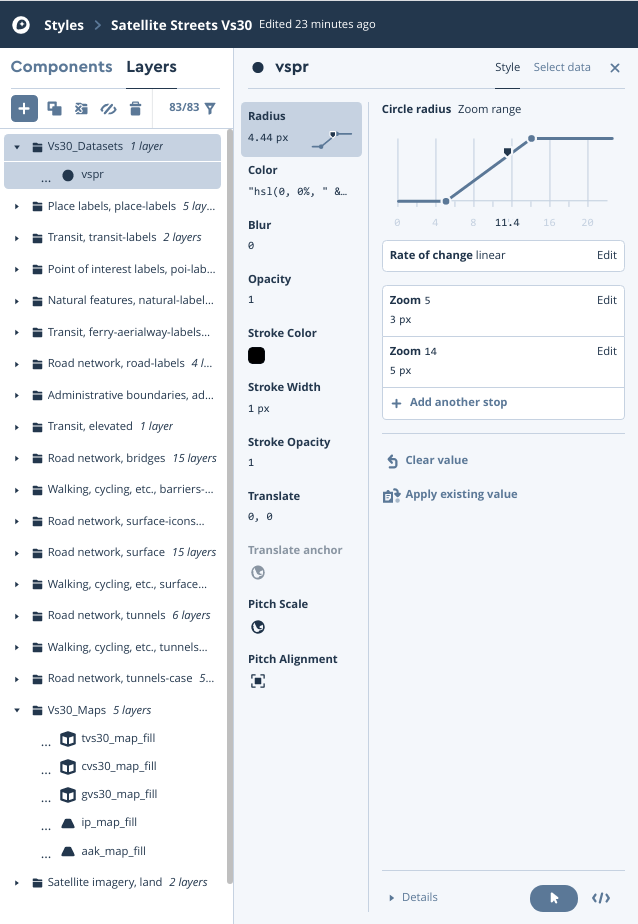
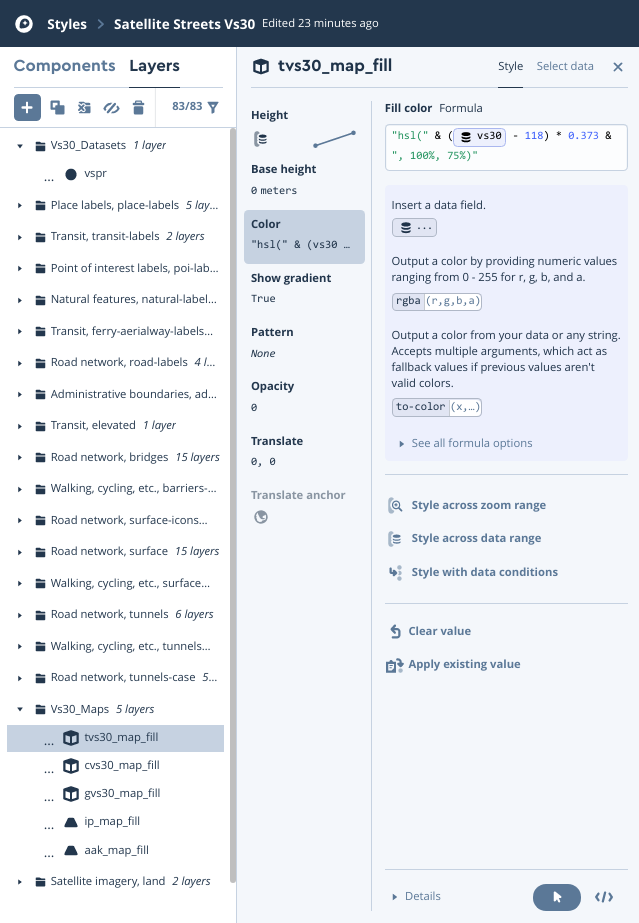
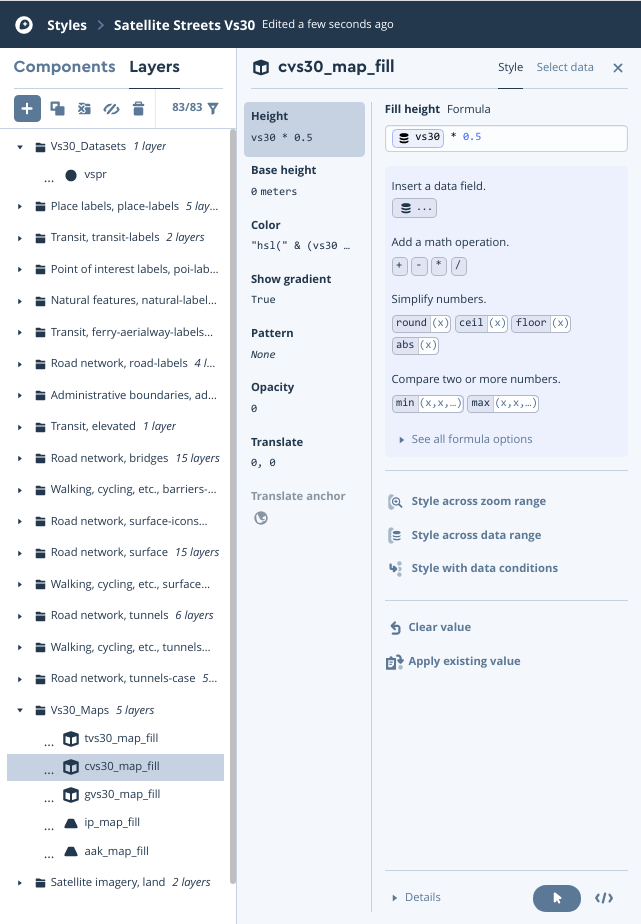

# Data preparation for upload to Mapbox

## Step 1: Convert datasets to be understood by tippecanoe
Script has been split into larger chunks for multiprocessing.

Datasets include the static large datasets such as Iwahashi and Pike, Geology QMAP data as well as outputs from `run_grid.R`.
```
./prepare1A.R
./prepare1B.R
./prepare1C.R
./prepare1D.R
```

## Step 2: Create mbtiles with tippecanoe
This allows more flexibility by being able to specify zoom levels where data is available amongst other things. Note the current pricing of tileset uploads and hosting. Currently zoom level 13 (~1m) is much cheaper than 14 (0.5m) or greater.
```
./prepare2.sh
```

## Step 3: Upload data to Mapbox
Upload the mbtiles to the tilesets section in your account. Once you have them in your account you can use the replace option to update data without changing the ID. Once updated, it may take about an hour for the changes to show up on any maps using the tilesets. In some cases it may appear to work at first but the map will revert to a previous version. In this case the issue should be resolved overnight.

## Step 4: Create a map on the server
`Satellite Streets` is a good basemap to work with because it has a single baselayer with streets/labels above.
Add layers above the baselayer but below all the roads/labels/etc.

Because there are 16 `aak_map` categories (0-15), that makes for a spacing of 22.5 on the colour circle. Currently you can set the colour fill formula as `"hsl(" & get("gid") * 22.5 & ", 100%, 75%)"`. Unlike `rgb`, the `hsl` specification at time of writing needs to be a string.

The `ip_map` categories range is (1-16) so the above formula can be used with `1` subtracted from the `gid`.

To set the colour of Vs30 overlays, take example `min_val = 118.9; max_val = 1080.3`. The formula would be `(vs30 - 118) * 0.373` where 0.373 is `360/(max-min)` or `360/(1081-118)` truncated.

Extrusion height is set by Vs30 (formula `Vs30 * 0.5` meters).

It may take a full day for changes to be visible on any maps.

Below are some screens from the map designer.





## Step 5: Update references
The layers in the map you create have IDs (names) and these should be updated in the Javascript `map.js` such as `ID_GEOCAT`. These are also used in the template `index.html`. Also the map itself has a style ID which should be updated in the Javascript and HTML.

Make sure to update the accessToken to one from your account (Javascript).
