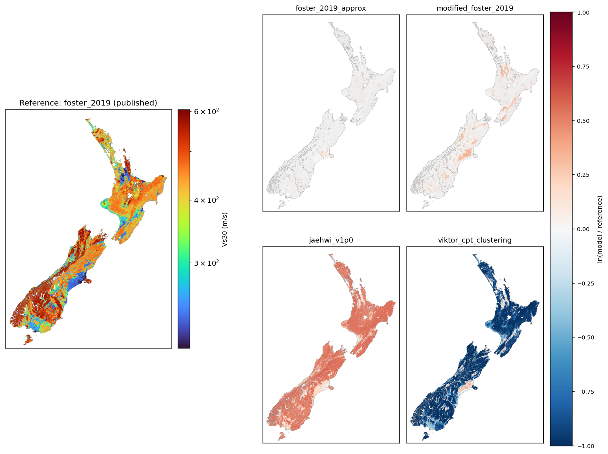

# Vs30

**Vs30** is the time-averaged shear-wave velocity in the upper 30 metres of ground. It's a key input to seismic hazard analysis because it influences how the ground responds during an earthquake.

Direct Vs30 measurement at a site requires a geotechnical investigation such as a seismic cone penetration test (sCPT). These are slow and expensive, so it isn't feasible to measure Vs30 at the density needed to cover a whole region. Instead, models infer Vs30 from geological and topographic maps and from related geotechnical data (e.g. cone penetration tests, CPTs, and standard penetration tests, SPTs).

This package provides four such models for New Zealand, plus a command-line tool, `vs30`, that queries them in two forms:

- **At specific sites** — given a CSV of latitude/longitude pairs, returns the Vs30 estimate at each point.
- **Across a regular grid** — given a bounding box and spacing, writes Vs30 maps as GeoTIFF rasters.

See the [Usage](Usage.md) page for installation and worked examples.

## Available models

### `foster_2019_approx`

A near-identical reproduction of the Vs30 map published by Foster et al. (2019). Minor implementation differences prevent an exact match, but typical differences are only a few percent.

### `modified_foster_2019`

The Foster et al. (2019) model, with these modifications:

- alluvium and floodplain Vs30 adjusted by distance from the coast
- exponential spatial correlation instead of Matérn
- some lower-quality Vs30 observations retained rather than excluded

### `jaehwi_v1p0`

The Foster et al. (2019) model with additional Vs30 measurements from the New Zealand National Seismic Hazard Model (NSHM).

### `viktor_cpt_clustering`

Extends `modified_foster_2019`, developed by Viktor Polak to incorporate ~35,700 CPT-derived Vs30 estimates, clustered with DBSCAN to avoid over-representing densely surveyed regions.

## Comparing the models

The left panel is the **reference**: the Vs30 map published by Foster et al. (2019). The four right panels show each model as a log-ratio difference map relative to that reference, `ln(model / reference)`. Red pixels are where a model predicts higher Vs30 (stiffer ground) than Foster 2019; blue pixels are where it predicts lower (softer); white means agreement.

### Higher-resolution maps

Each model below links to two single-panel diff variants. The **shared-scale** version uses the same ±1.0 ln-units colourbar as the composite above, so models remain directly comparable. The **autoscaled** version rescales to each panel's 1st–99th percentile so small within-model features (e.g. MVN residuals near observation sites) become visible.

- Reference: [foster_2019 (published)](images/reference_foster_2019.png)
- foster_2019_approx: [shared scale](images/foster_2019_approx_diff.png) · [autoscaled](images/foster_2019_approx_diff_autoscale.png)
- modified_foster_2019: [shared scale](images/modified_foster_2019_diff.png) · [autoscaled](images/modified_foster_2019_diff_autoscale.png)
- jaehwi_v1p0: [shared scale](images/jaehwi_v1p0_diff.png) · [autoscaled](images/jaehwi_v1p0_diff_autoscale.png)
- viktor_cpt_clustering: [shared scale](images/viktor_cpt_clustering_diff.png) · [autoscaled](images/viktor_cpt_clustering_diff_autoscale.png)

## References

- Foster, K. M., Bradley, B. A., McGann, C. R., & Wotherspoon, L. M. (2019). A Vs30 Map for New Zealand Based on Geologic and Terrain Proxy Variables and Field Measurements. *Earthquake Spectra*, 35(4), 1865–1897. https://doi.org/10.1193/121118EQS281M ([PDF in this repo](../reference_papers/foster_2019_nz_vs30_map.pdf))
